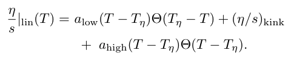
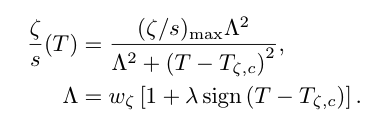
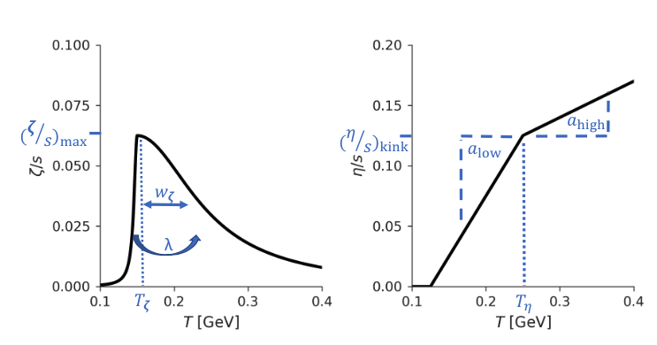

# JSSS2022 Hydro Session

# Table of contents
- **Part I. Introduction**
  - i. Background
  - ii. Goals
- **Part II. Build the JETSCAPE framework**
  - i. Prerequisite: Download necessary code packages
  - ii. Set up a docker container
  - iii. Build JETSCAPE with MUSIC and iSS
- **Part III. Get ready for the Hydro Session**
  - i. Copy Hydro Session scripts to the working directory
  - ii. Visualization with Jupyter Notebook
  - iii. Setup with different parameter files
- **Part IV. Run the JETSCAPE framework**
  - Exercise 1. Run JETSCAPE and compare to data
  - Exercise 2. Plot results from MUSIC and understand hydro evolution
  - Exercise 3. Plot flow velocity evolution and see effects from shear viscosity
  - Exercise 4. Plot particles mean $p_T$ and see effects from bulk viscosity

- **Homework**
  - Temperature dependent $(\eta/s)(T)$ and $(\zeta/s)(T)$

# Part I. Introduction 

> Note: Please join the Slack Channel: [# july27-28-bulk-dynamics](https://jetscapeschool2022.slack.com/archives/C03G5K1CHN3) and post your questions there.

> The instructions below are adapted from the materials of the Hydro Sessions at [Summer School 2021](https://github.com/JETSCAPE/SummerSchool2021/tree/master/Jul21_Hydro/hydro_session) and [Summer School 2020](https://github.com/JETSCAPE/SummerSchool2020/tree/master/hydro_session) (Lecturer: Chun Shen).

## i. Background

The [JETSCAPE](http://jetscape.org/) simulation framework is an overarching computational envelope for developing complete event generators for heavy-ion collisions. It allows for modular incorporation of a wide variety of existing and future software that simulates different aspects of a heavy-ion collision. We will use the following modules within the JETSCAPE framework for the Hydro Session today and tomorrow:

```c++
'Trento' (initial condition) + 'MUSIC' (hydrodynamics) + 'iSS' (particlization)
```

We employ the `Trento` model to generate event-by-event initial energy density profile. The energy density profile is then passed to the hydrodynamic module `MUSIC`, which will evolve the collision system starting as a hot QGP to a hadron gas. Optionally, pre-equilibrium dynamics modeled by `free-streaming` can be included between Trento and MUSIC. In the dilute hadronic phase, fluid cells will convert to individual hadrons. This process is denoted as the particlization, for which we use `iSS` particle sampler. (The produced hadrons can be further fed to a hadronic transport model `SMASH`, which accounts for scattering processes among hadrons and decays of excited resonance states. This will be discussed in the Transport Session by Jan following the Hydro Session.)

## ii. Goals

- In this Hydro Session, participants will understand how to run JETSCAPE with a few default modules and set/change their relevant parameters, such as transport coefficients of the hydrodynamic module;

- With a realistic hydrodynamic module, participants will be able to output hydrodynamic evolution profile and analyze the evolution of temperature and the development of flow velocity with various settings;

- Participants will simulate event-by-event bulk dynamics for Au+Au @ 200 GeV and Pb+Pb @ 5020 GeV with some realistic settings, and understand the viscous effects on a few hydrodynamic quantities/observables.

# Part II. Build the JETSCAPE framework

> **Note on the working directory**
>
> We will work in a folder named `/jetscape-docker` in our `home` directory (i.e. under `~/jetscape-docker`), and the scripts below are based on this. If you download your code packages in a different directory or name the folder differently, then you need to substitute your directory name appropriately in the remainder of the instructions.

> **Note for people who use remote computers**
>
> If you plan to do exercises on a remote computer with `ssh`, please use the following command to log in to your remote machine,
>
> ```shell
> ssh -L 8888:127.0.0.1:8888 user@server
> ```
>
> The port information is essential to properly setup jupyter notebook below. The rest of the exercises on a remote machine should follow the same steps below.

## i. Prerequisite: Download necessary code packages

Following the instructions on the preparation (https://github.com/JETSCAPE/SummerSchool2022), you should have already downloaded all the code packages needed. **If you haven't downloaded the packages yet**, you can follow the steps below to do so. Below is the scripts to run in your  `Terminal` to get ready.

```shell
# get into home directory
cd ~
# make a directory named /jetscape-docker in the home directory
mkdir jetscape-docker
cd jetscape-docker
# download JETSCAPE code packages in /jetscape-docker
git clone https://github.com/JETSCAPE/JETSCAPE.git
git clone https://github.com/JETSCAPE/SummerSchool2022.git
git clone https://github.com/JETSCAPE/STAT.git
# download modules needed for the Hydro Session
cd JETSCAPE/external_packages
./get_music.sh
./get_iSS.sh
```

Now please make sure all the code packages are already in the correct place on your computer. You should have a `jetscape-docker` folder under your `home` directory. Try to list the folders inside `jetscape-docker` with the following command,

```shell
ls ~/jetscape-docker
```

and you should see `JETSCAPE/` and `SummerSchool2022/` present. If you list folders inside `~/jetscape-docker/JETSCAPE/external_packages` with

```shell
ls ~/jetscape-docker/JETSCAPE/external_packages
```

you should see `music/` and `iSS/` folders present. **They are modules needed for the Hydro Session.**

## ii. Set up a docker container

> Note: If you want to use yesterday's docker container, that should be fine. However, it's likely that yesterday's JETSCAPE was not built with `MUSIC` and `iSS`. So in the next section **Build JETSCAPE with MUSIC and iSS**, you will still need to build JETSCAPE with those two modules on. See next section for details.

In this session, we need to launch a docker container that supports the jupyternotebook. Please use the following command:

- **macOS:**

```shell
docker run -it -v ~/jetscape-docker:/home/jetscape-user --name JSHYDRO -p 8888:8888 jetscape/base:stable
```

This takes me **3-4 mins**.

- **Linux:**

```shell
docker run -it -v ~/jetscape-docker:/home/jetscape-user --name JSHYDRO -p 8888:8888 --user $(id -u):$(id -g) jetscape/base:stable
```

The option `-p 8888:8888` above creates a port for your web browser outside the docker container to load a jupyter notebook. All the python packages are in the docker container. Under Linux, if you encounter an error like `permission denied`, you can use `sudo` in front of the docker run command.

After the docker container is successfully se up, we can see the prompt of the `Terminal` is different: Before docker container set up, my `Terminal` looks like

```shell
(base) Lipei@Lipeis-MacBook-Pro jetscape-docker %
```

After the docker is set up and we are inside the docker container, it looks like

```sh
jetscape-user@6bd94e16d1c3:~$
```

<details>


<summary>Expand to see some useful commands using docker containers</summary>

- To see the containers you have running, and get their ID: `docker container ls` (`-a` to see also stopped containers)
- To stop the container: `docker stop <container>` or `exit`
- To re-start the container: `docker start -ai <container>`
- To delete a container: `docker container rm <container>`

</details>

## iii. Build JETSCAPE with MUSIC and iSS

> Note: Below we will buid JETSCAPE and do all of our exercises in the `JETSCAPE/build` directory (a directory to be made).

When you are **inside the docker container**, type the following commands to setup the working directory,

```shell
cd ~/JETSCAPE
mkdir -p build
cd build
cmake .. -DUSE_MUSIC=ON -DUSE_ISS=ON
make -j4
```

Flags `-DUSE_MUSIC=ON -DUSE_ISS=ON` above mean we are building JETSCAPE framework with `MUSIC` and `iSS` modules on. For your reference, building the JETSCAPE framework took me **18 mins** on an early 2015 MacBook Pro.

# Part III. Get ready for the Hydro Session

## i. Copy Hydro Session scripts to the working directory

> Note: We will copy scripts in `SummerSchool2022/Jul28_Hydro/` to our working directory `JETSCAPE/build` so that we can use the scripts therein to analyse the simulation results that will be generated by JETSCAPE. We will be running the following command lines in directory: `JETSCAPE/build`.

```shell
cd ~/JETSCAPE/build
```

To copy scripts in `SummerSchool2022/Jul28_Hydro/` to our working directory `JETSCAPE/build` , use the following command

```shell
cp -r ../../SummerSchool2022/Jul28_Hydro ./hydro_session
```

Above the last `.` represent the current directory we are in, i. e. `JETSCAPE/build`; please don't miss it.

In the `hydro_session/` folder, we have the following folders

```shell
config # constains some xml files we will use to set up JETSCAPE parameters
jupyter # contains jupyter notebooks we will use to make plots
data # contains some measurements we will compare to
plots # contains plots generated by the jupyter notebooks
```

and a shell script

```shell
collect_all_results.sh
```

which moves all the hydro output into a folder in `hydro_session/`.

## ii. Visualization with Jupyter Notebook

> Note: We will be running the following command lines in directory: `JETSCAPE/build`

Launch jupyter notebook **inside the docker container** with the following command in our working directory`JETSCAPE/build`

```shell
jupyter notebook --ip 0.0.0.0 --no-browser
```

Below is what shows up in my `Terminal` after I run the line above

```shell
[I 14:07:35.127 NotebookApp] Use Control-C to stop this server and shut down all kernels (twice to skip confirmation).
[C 14:07:35.146 NotebookApp] 
    
    To access the notebook, open this file in a browser:
        file:///home/jetscape-user/.local/share/jupyter/runtime/nbserver-11-open.html
    Or copy and paste one of these URLs:
        http://6bd94e16d1c3:8888/?token=f8e862466974516a4da6d77e15d7d53e96954ea513b663a7
     or http://127.0.0.1:8888/?token=f8e862466974516a4da6d77e15d7d53e96954ea513b663a7
```

Once you get similar things as above, you can click on the link `http://127.0.0.1:8888/?token=` by holding the `ctrl` key and then click on `Open Link`. After the click, your web browser should be launched showing the current directory. If your terminal does not recognize html addresses, you can copy `http://127.0.0.1:8888/?token=` and paste it in your browser address bar.

## iii. Setup with different parameter files

> We will brief discuss below how the parameters are handled in the framework. Regarding `MUSIC`, three parameter files are relevant: user xml files in `JETSCAPE/build/hydro_session/config`, master xml file `JETSCAPE/config/jetscape_master.xml` and `JETSCAPE/build/music_input`. See below for more details.

As users of the JETSCAPE framework, mostly we only need to provide a `user XML file`. You can find a few examples of `user XML files` used in our Hydro Session in `JETSCAPE/build/hydro_session/config`. (There are also a few example user files in `JETSCAPE/config/` provided by the framework.) Below is a simple example of user XML file.

<details>

​	<summary>Click to see the example of `user XML file`</summary>


```xml
<?xml version="1.0"?>

<jetscape>
    <!-- General settings -->
    <nEvents> 1 </nEvents>
    <!-- fix the random seed -->
    <Random>
        <seed>23</seed>
    </Random>
    <!-- Inital State Module  -->
    <IS>
        <!-- set boost invariant simulation -->
        <grid_max_z> 0.0 </grid_max_z>
        <!-- Initial condition -->
        <Trento> </Trento>
    </IS>
    <!--Preequilibrium Dynamics Module -->
    <Preequilibrium>
        <NullPreDynamics> </NullPreDynamics>
    </Preequilibrium>
    <!-- Hydro  Module  -->
    <Hydro>
        <MUSIC>
            <freezeout_temperature>0.150</freezeout_temperature>
        </MUSIC>
    </Hydro>
</jetscape>
```

</details>

The parameters we set in this user XML file will overwrite the ones in the `master XML file` which can be found in `JETSCAPE/config/jetscape_master.xml` ([Link](https://github.com/JETSCAPE/JETSCAPE/blob/main/config/jetscape_master.xml); we don't change this file at all.). The master XML file contains default values for every possible module and parameter settings which will be used for all activated modules (as specified by the user XML file), if they are not overridden in the user XML file (in the example above, we only set the parameter `<freezeout_temperature>` in the user XML file for `MUSIC`). The box below contains the parameters of `MUSIC` in the `jetscape_master.xml`.

<details>

​	<summary>Click to see part of `jetscape_master.xml`</summary>


```xml
<!-- MUSIC  -->
<MUSIC>
  <name>MUSIC</name>
  <MUSIC_input_file>music_input</MUSIC_input_file>
  <Initial_time_tau_0>0.5</Initial_time_tau_0>
  <output_evolution_to_file>1</output_evolution_to_file>
  <shear_viscosity_eta_over_s>0.08</shear_viscosity_eta_over_s>
  <T_dependent_Shear_to_S_ratio>0</T_dependent_Shear_to_S_ratio>
  <eta_over_s_T_kink_in_GeV>0.16</eta_over_s_T_kink_in_GeV>
  <eta_over_s_low_T_slope_in_GeV>0.</eta_over_s_low_T_slope_in_GeV>
  <eta_over_s_high_T_slope_in_GeV>0.</eta_over_s_high_T_slope_in_GeV>
  <eta_over_s_at_kink>0.08</eta_over_s_at_kink>
  <temperature_dependent_bulk_viscosity>0</temperature_dependent_bulk_viscosity>
  <zeta_over_s_max>0</zeta_over_s_max>
  <zeta_over_s_T_peak_in_GeV>0.18</zeta_over_s_T_peak_in_GeV>
  <zeta_over_s_width_in_GeV>0.02</zeta_over_s_width_in_GeV>
  <zeta_over_s_lambda_asymm>0.0</zeta_over_s_lambda_asymm>
  <Include_second_order_terms>1</Include_second_order_terms>
  <freezeout_temperature>-1</freezeout_temperature>
  <Perform_CooperFrye_Feezeout>0</Perform_CooperFrye_Feezeout>
</MUSIC>
```

</details>

As you can see, it contains much more parameters that we didn't change in the above user XML file. You can read more about the XML configuration [here](https://github.com/JETSCAPE/JETSCAPE#the-xml-configuration).

In fact, there are some other parameters of `MUSIC` that are not controlled through the JETSCAPE settings specified by the above two XML files, and these parameters are specified in the parameter file of the `MUSIC` module itself: `JETSCAPE/build/music_input`. However, the above two XML files contains most of the parameters we need to change in realistic simulations. The other modules also have their own parameter file; for example, `iSS` particle sampler has its own parameter file `JETSCAPE/build/iSS_parameters.dat`.

<details>
​	<summary>Click to see some notes on random seed setting</summary>  


Users can specify a random seed for the entire simulation. This is specified inside the block `<Random>` in the xml file. If the `<seed>` parameter is set to 0. Then the random seed will be determined by the system time. If `<seed>` is set to any positive number, the JETSCAPE will perform simulations with the given positive number as the random seed for all its modules. A fixed seed simulation will be handy when we study the effect of viscosity during the hydrodynamic evolution.

</details>

# Part IV. Run the JETSCAPE framework

> Note: We will run the scripts below in `JETSCAPE/build` directory. Executable file `runJetscape` in the directory is for running the JETSCAPE framework.

Now we are ready to run the JETSCAPE framework with a few user XML files in `JETSCAPE/build/hydro_session/config` and use corresponding jupyter notebooks in `JETSCAPE/build/hydro_session/jupyter` to plot the results of a few exercises listed below for this Hydro Session.

| Exercise | Collision system      | Viscosities              | Topic                             | user XML file and Jupyter                                    |
| -------- | --------------------- | ------------------------ | --------------------------------- | ------------------------------------------------------------ |
| #1       | 0-5% Au-Au@200 GeV    | $\eta/s=0, \zeta/s(T)$   | particle yields and spectra       | config/jetscape_user_exercise_1.xml jupyter/exercise_1_particle_spectra.ipynb |
| #2       | 20-30% Pb-Pb@2.76 TeV | $\eta/s=0, \zeta/s=0$    | evolution of flow and temperature | config/jetscape_user_exercise_2.xml jupyter/exercise_2_hydro_movie.ipynb |
| #3       | 20-30% Pb-Pb@2.76 TeV | $\eta/s=0.15, \zeta/s=0$ | effects of shear viscosity        | config/jetscape_user_exercise_3.xml jupyter/exercise_3_shear_viscosity.ipynb |
| #4       | 20-30% Pb-Pb@2.76 TeV | $\eta/s=0, \zeta/s(T)$   | effects of bulk viscosity         | config/jetscape_user_exercise_4.xml jupyter/exercise_4_particle_pT.ipynb |
| homework | 30-40% Pb-Pb@5.02 TeV | $\eta/s(T), \zeta/s(T)$  | temperature-dependent viscosities | config/jetscape_user_homework.xml jupyter/homework_hydro_movie.ipynb |

## Exercise 1. Run JETSCAPE and compare to data

> In this exercise, we will run the framework with the [user XML file](https://github.com/JETSCAPE/SummerSchool2022/blob/main/Jul28_Hydro/config/jetscape_user_exercise_1.xml) `jetscape_user_exercise_1.xml`, which runs `Trento+MUSIC+iSS` and produces a particle list, and then we save all the results in a folder `run_exercise_1`. 

In  `JETSCAPE/build` directory, run the following scripts

```
./runJetscape hydro_session/config/jetscape_user_exercise_1.xml
./FinalStateHadrons test_out.dat hadron_list.dat
./hydro_session/collect_all_results.sh run_exercise_1
```

The last line above create a folder `run_exercise_1` and moves all results there. After it's done, you should find a folder `hydro_session/run_exercise_1` which has all the results of this event inside. 

With the produced `hadron_list.dat` file, the users can apply the analysis script to compute particle spectra, mean $p_T$. In your browser, we first go into the `hydro_session` folder, and then open the notebook `exercise_1_particle_spectra.ipynb` by clicking on it. Once the notebook is open, the user can execute the cells in this notebook. Press `shift+enter` to execute the cell blocks in the notebook. 

### More about settings and output files

In `jetscape_user_exercise_1.xml`, we use the following settings

```xml
<!-- General settings -->
<nEvents> 10 </nEvents>
<setReuseHydro> true </setReuseHydro>
<nReuseHydro> 10 </nReuseHydro>
<JetScapeWriterAscii> on </JetScapeWriterAscii>
```

which mean the framework will run `<nEvents>` events in total, but every hydro file will be reused `<nReuseHydro>` times. As a results, for each hydro freeze-out surface, we will run the particle sampler `iSS`  `<nReuseHydro>`  times.

#### a. Hydro stage: MUSIC

The result files from MUSIC are listed in the box below:

```shell
# evolution of a few hydro quantities
meanpT_estimators_eta_-0.5_0.5.dat
meanpT_estimators_tau_*.dat
eccentricities_evo_ed_tau_*.dat
eccentricities_evo_eta_-0.5_0.5.dat
eccentricities_evo_nB_tau_*.dat
momentum_anisotropy_tau_*.dat
momentum_anisotropy_eta_-0.5_0.5.dat
inverse_Reynolds_number_eta_-0.5_0.5.dat
# freeze-out surface
surface_MUSIC.dat
# full space-time evolution of hydro
evolution_all_xyeta_MUSIC.dat
```

We will make some plots of hydro evolution using a few files in the box in **Exercise 2** below.

#### b. Particlization: iSS

In JETSCAPE, the particle sampler iSpectraSampler (iSS) is employed to convert fluid cells to particles. The iSS samples particles from the hydrodynamic hyper-surface `surface_MUSIC.dat`. We use the following settings for `iSS`:

```xml
<!-- Particlization Module  -->
<SoftParticlization>
  <iSS> 
  	<number_of_repeated_sampling>1</number_of_repeated_sampling>
  	<Perform_resonance_decays>1</Perform_resonance_decays>
  </iSS>
</SoftParticlization>
```

which means in every event, one carries out the particle sampler `<number_of_repeated_sampling>` times, and then let the resonances decay. Setting `<Perform_resonance_decays>` as `0` will keep all the resonances in the particle list, and then one can feed this list in `SMASH` for the hadronic afterburner.

When `iSS` samples particles, the spatial and momentum distributions of them follow the Cooper-Frye formula. The sampled hadrons are written in `test_out.dat` which contains:

```python
0 Event
# sigmaGen -1
# sigmaErr -1
# weight 1
# JetScape module: iSS
# Final State Bulk Hadrons
[0] H 0 -211 11 1.04891 -3.47653 0.583712 16.9814 3.08669 1.34649 -147.763 147.95
[1] H 0 -211 11 0.447064 1.87298 2.87919 1.4954 -6.34382 -1.05008 26.6999 27.036
[2] H 0 -211 11 0.461259 -3.45958 3.99722 7.34344 -1.91193 -4.53985 -69.9682 70.1573
[3] H 0 -211 11 0.574241 1.96799 2.98754 2.09938 -2.87482 -1.05026 35.6444 36.4561
...
...
```

By running another script `FinalStateHadrons`, one can extract the final state hadron list from the `test_out.dat` file (i.e. `./FinalStateHadrons test_out.dat hadron_list.dat` above.) This line generates the file `hadron_list.dat`. Below is what is in `hadron_list` file:

```python
#	1.4822e-322	Event1ID	5841	pstat-EPx	Py	Pz	Eta	Phi
0 -211 11 16.9814 0.875234 0.578081 -16.9485 -3.47653 0.583712
1 -211 11 1.4954 -0.431761 0.115969 1.42032 1.87298 2.87919
2 -211 11 7.34344 -0.302468 -0.348242 -7.3276 -3.45958 3.99722
3 -211 11 2.09938 -0.56744 0.0881139 2.01459 1.96799 2.98754
...
...
```


## Exercise 2. Plot results from MUSIC and understand hydro evolution

In  `JETSCAPE/build` directory, run the following scripts

```
./runJetscape hydro_session/config/jetscape_user_exercise_2.xml
./FinalStateHadrons test_out.dat hadron_list.dat; ./hydro_session/collect_all_results.sh run_exercise_2
```

In this exercise, we use the following settings for MUSIC and thus run an ideal hydro evolution. Later we will compare this evolution to the other cases with viscous effects.

```xml
<MUSIC>
  <name>MUSIC</name>
  <shear_viscosity_eta_over_s>0.</shear_viscosity_eta_over_s>
  <temperature_dependent_bulk_viscosity>0</temperature_dependent_bulk_viscosity>
  <freezeout_temperature>0.150</freezeout_temperature>
</MUSIC>
```

From `Terminal`, you can see indeed the framework runs ideal hydro evolution:

```shell
🎵 166.3 MB  ----- information on initial distribution -----
🎵 166.3 MB initialized with a JETSCAPE initial condition.
🎵 166.3 MB Running ideal hydrodynamic simulations ...
🎵 166.3 MB Setting the initial viscous tensor to zero.
🎵 166.3 MB initial distribution done.
```

In this exercise, we will plot the results in the following files to show the hydro evolution:

1. **spacial eccentricity:** `eccentricities_evo_eta_-0.5_0.5.dat` which records the evolution of spacial eccentricity of the fireball.
2. **momentum anisotropy:** `momentum_anisotropy_eta_-0.5_0.5.dat`.
3. **average velocity and average temperature:**`inverse_Reynolds_number_eta_-0.5_0.5.dat`.
4. **space-time hydro evolution:** `evolution_all_xyeta_MUSIC.dat`. This file contains the evolution history of fluid cells above T = 140 MeV.

To plot the results, open the jupyter notebook `hydro_session/jupyter/exercise_2_hydro_movie.ipynb` in your browser and then run all the cells to generate 2D color contour plots as well as animation for the temperature and fluid velocity evolution.

## Exercise 3. Plot flow velocity evolution and see effects from shear viscosity

In  `JETSCAPE/build` directory, run the following scripts

```shell
./runJetscape hydro_session/config/jetscape_user_exercise_3.xml; ./hydro_session/collect_all_results.sh run_exercise_3
```

We don't sample particles for this case to save some computational time. Please use `hydro_session/jupyter/exercise_3_shear_viscosity.ipynb` to plot the results.

We use the following parameters for `MUSIC` in `config/jetscape_user_exercise_3.xml`

```xml
<MUSIC>
  <name>MUSIC</name>
  <shear_viscosity_eta_over_s>0.15</shear_viscosity_eta_over_s>
  <temperature_dependent_bulk_viscosity>0</temperature_dependent_bulk_viscosity>
  <freezeout_temperature>0.150</freezeout_temperature>
</MUSIC>
```

which set bulk viscosity zero, and specific shear viscosity constant 0.15.

## Exercise 4. Plot particles mean $p_T$ and see effects from bulk viscosity

In  `JETSCAPE/build` directory, run the following scripts

```shell
./runJetscape hydro_session/config/jetscape_user_exercise_4.xml; ./FinalStateHadrons test_out.dat hadron_list.dat; ./hydro_session/collect_all_results.sh run_exercise_4
```

We use the following parameters for `MUSIC` in `config/jetscape_user_exercise_4.xml`

```xml
<MUSIC>
  <name>MUSIC</name>
  <shear_viscosity_eta_over_s>1.e-3</shear_viscosity_eta_over_s>
  <temperature_dependent_bulk_viscosity>9</temperature_dependent_bulk_viscosity>
  <freezeout_temperature>0.150</freezeout_temperature>
</MUSIC>
```

Here we set a very small but nonzero value for `<shear_viscosity_eta_over_s>`, because in the default settings of JETSCAPE, making it smaller than `1.e-6` would make `Viscosity_Flag_Yes_1_No_0=0` and thus turn off bulk viscosity as well. However, in this exercise, we would like to have nonzero bulk viscosity but not shear viscosity.

# Homework

## Temperature dependent $(\eta/s)(T)$ and $(\zeta/s)(T)$

For the homework, we will use user XML file `hydro_session/config/jetscape_user_homework.xml`. In this file, one can try a temperature-dependent $(\eta/s)(T)$ by setting the variable `<T_dependent_Shear_to_S_ratio>` to `3`. Once this parameter is set to 3, the previous parameter `<shear_viscosity_eta_over_s>` will be ineffective. The users need to further specify the following four parameters,

```
<eta_over_s_T_kink_in_GeV>
<eta_over_s_low_T_slope_in_GeV>
<eta_over_s_high_T_slope_in_GeV>
<eta_over_s_at_kink>
```

to characterize the temperature dependence of $(\eta/s)(T)$.

 

Similar to the case for $(\eta/s)(T)$, the users can set the parameter `<temperature_dependent_bulk_viscosity>` to `3` in the xml file to include a temperature dependent $(\zeta/s)(T)$. With `<temperature_dependent_bulk_viscosity>` set to 3, the users needs to further provide four additional parameters to characterize the shape of $(\zeta/s)(T)$. They are as follows,

```
<zeta_over_s_max>
<zeta_over_s_T_peak_in_GeV>
<zeta_over_s_width_in_GeV>
<zeta_over_s_lambda_asymm>
```

The parameterization is

 

Users can play with settings in `hydro_session/config/jetscape_user_homework.xml` and run JETSCAPE with it.

```
./runJetscape hydro_session/config/jetscape_user_homework.xml
./hydro_session/collect_all_results.sh run_homework
```

The parametrization of shear and bulk viscosities in `jetscape_user_homework.xml` are shown below (from [paper of JETSCAPE](https://arxiv.org/pdf/2011.01430)).

 

The plotting scripts used in the above exercises can be adapted to plot the results (as an example, see `hydro_session/jupyter/homework_hydro_movie.ipynb`). You can pick your favorite collision system (colliding nuclei, collision energy, and centrality) and generate a hydrodynamic evolution animation. 
